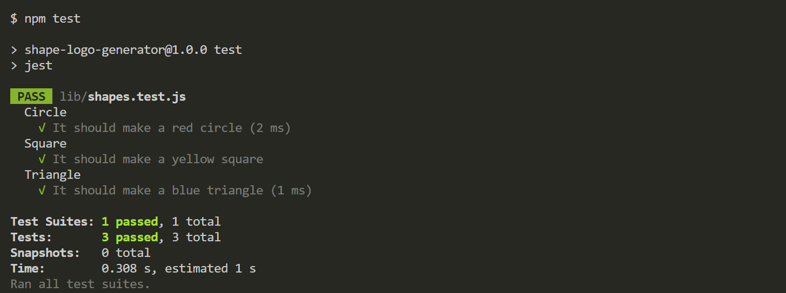

# Challenge-10-Shape-Generator

## Description

In the early stages of producing a web application, it can be helpful to have placeholder assets while working on the structure and functionality of your application. This application provides users with a way to quickly create temporary logos in the form of SVG (scalable vector graphics) files that can be used in developing their application. Users can input upwards to 3 characters into the logo customize the logo with a predefined selection of colors for the background shape and for the characters to suit their purposes.

## Table of Contents
* [Description](#description)
* [Installation](#installation)
* [Usage](#usage)
* [Contributions](#contributions)
* [Test](#test)
* [License](#license)
* [Questions and Contacts](#questions-and-contacts)

## Installation

[Visual Studio Code](https://code.visualstudio.com/), [GitBash](https://git-scm.com/downloads) and [Node.js](https://nodejs.org/en) must be installed onto the user’s computer. The recommended version of Node.js 18.17.1 LTS.

Once the required software has been successfully installed on the computer, clone this GitHub repository to a desired folder on the computer.

[The Repository of the Shape Logo Generator](https://github.com/Hello-AndyJoe/Challenge-10-Shape-Generator)

The repository does not include the modules from the Inquirer or Jest NPM. Install them into the clone repository by running `npm i` in a GitBash terminal within Visual Studio Code. 

## Usage

When the installaion process from above is complete, the user can now this application. Open the code in Visual Studio Code and open a GitBash terminal. 

Next, enter `node idex.js` in the terminal and follow the prompts. If the user enters more than 3 characters in that related prompt, the terminal will not move on to the next prompt until the user corrects the input.

Once all prompts have been answered successfully, the terminal will display `Generated logo.svg`. The generated logo can be found in the repository with the folder 'examples'.

[Video Showing the Logo Generator](https://drive.google.com/file/d/10tLZ2u4U_Pimb5cGZU1z97CBYNk7EWIJ/view?usp=sharing)

## Contributions

Activities 11-Ins_Setup-Jest through 16-Stu_Passing-Test of Module 10 - Object-oriented programming where used for reference for creating the test portion of this application.

[NPM Inquirer 8.2.4](https://www.npmjs.com/package/inquirer/v/8.2.4) and its documentation used for the construction of the questions that appear via prompts. 

[NPM Jest 29.7.0](https://www.npmjs.com/package/jest/v/29.7.0) and its documentation used for the construction of the questions that appear via prompts. 

## Test

Included in this application is a JavaScript file that will initiate a series of 3 tests. To run them, the user needs to enter into the terminal `npm test`. 

The results for the test should be successful as shown below:

## License
MIT

## Questions and Contacts
Visit other repositories created by me at [github.com/hello-andyjoe](https://github.com/hello-andyjoe)

If you have questions, please email me at [andrew.joseph.roper@gmail.com](mailto:andrew.joseph.roper@gmail.com)
